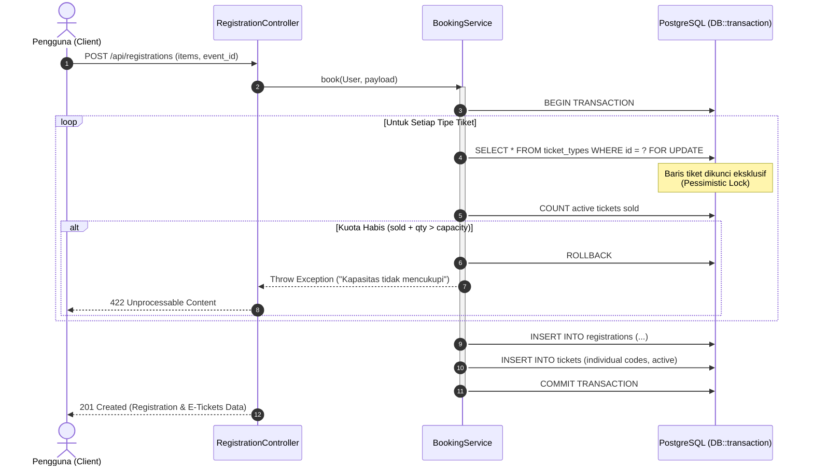
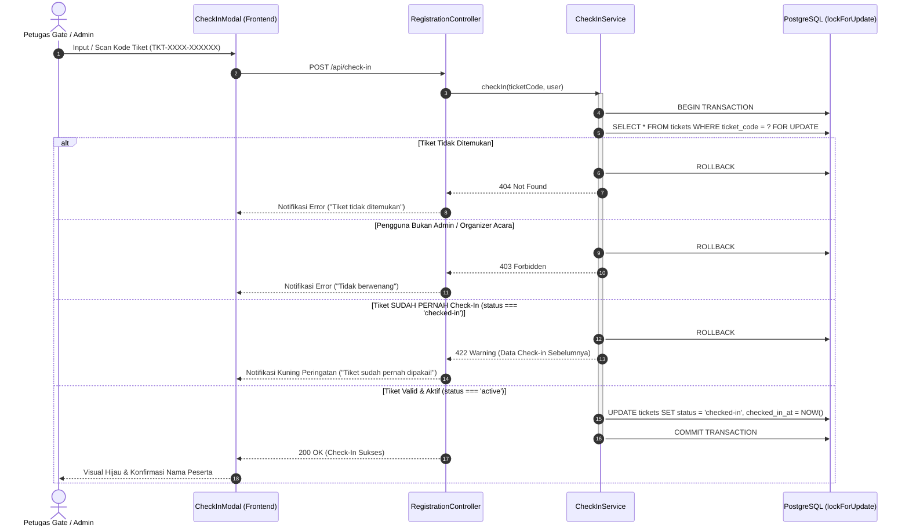
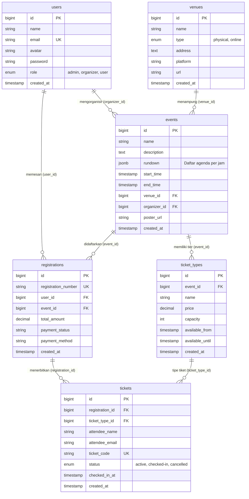

# 🎟️ Acara Tech — Sistem Registrasi Acara & Manajemen E-Tiket Modern (v2.0)

[](https://laravel.com)
[](https://php.net)
[](https://www.postgresql.org/)
[](https://react.dev)
[](https://vitejs.dev)
[](https://tailwindcss.com)
[](https://www.framer.com/motion/)
[](.github/workflows/ci.yml)
[](LICENSE)

**Acara Tech** adalah platform manajemen acara (_event management_), reservasi tiket multi-tier, penerbitan e-tiket digital berbasis QR Code, dan sistem check-in tiket waktu nyata (_real-time_). Proyek ini telah direkayasa ulang secara menyeluruh (_reworked v2.0_) dari aplikasi monolitik PHP native menjadi arsitektur terpisah (_decoupled architecture_) dengan standar industri modern: **Laravel 12 REST API** yang terlindungi transaksi atomik dan konkurensi tinggi, basis data relasional **PostgreSQL 16**, serta frontend interaktif **React 19 SPA** dengan **Tailwind CSS v4** dan **Framer Motion**.

---

## 📑 Daftar Isi

- [🚀 Ikhtisar & Arsitektur Sistem](#-ikhtisar--arsitektur-sistem)
- [✨ Fitur-Fitur Utama](#-fitur-fitur-utama)
  - [1. Pengalaman Pengguna (Public & Attendee)](#1-pengalaman-pengguna-public--attendee)
  - [2. Panel Kontrol Penyelenggara & Admin](#2-panel-kontrol-penyelenggara--admin)
  - [3. Keamanan Transaksi & Keandalan Sistem](#3-keamanan-transaksi--keandalan-sistem)
- [📊 Alur Logika Bisnis & Concurrency Guard](#-alur-logika-bisnis--concurrency-guard)
  - [Alur Transaksi Pemesanan Tiket (Pessimistic Lock)](#alur-transaksi-pemesanan-tiket-pessimistic-lock)
  - [Alur Validasi Check-In Tiket QR Code (Anti Double-Scan)](#alur-validasi-check-in-tiket-qr-code-anti-double-scan)
- [🗄️ Skema Basis Data & ERD](#️-skema-basis-data--erd)
- [📁 Struktur Direktori Repositori](#-struktur-direktori-repositori)
- [🔑 Akun Uji Coba (Demo Quick Login)](#-akun-uji-coba-demo-quick-login)
- [🛠️ Panduan Instalasi & Menjalankan Proyek](#️-panduan-instalasi--menjalankan-proyek)
  - [Prasyarat Perangkat Lunak](#prasyarat-perangkat-lunak)
  - [Langkah 1: Kloning Repositori](#langkah-1-kloning-repositori)
  - [Langkah 2: Konfigurasi Basis Data PostgreSQL](#langkah-2-konfigurasi-basis-data-postgresql)
  - [Langkah 3: Konfigurasi & Menjalankan Backend (Laravel 12)](#langkah-3-konfigurasi--menjalankan-backend-laravel-12)
  - [Langkah 4: Konfigurasi & Menjalankan Frontend (Vite + React)](#langkah-4-konfigurasi--menjalankan-frontend-vite--react)
- [📡 Dokumentasi RESTful API Lengkap](#-dokumentasi-restful-api-lengkap)
  - [Katalog Endpoint Ringkas](#katalog-endpoint-ringkas)
  - [Contoh Payload Permintaan & Respons Kunci](#contoh-payload-permintaan--respons-kunci)
- [🧪 Pengujian, Linting & CI/CD Pipeline](#-pengujian-linting--cicd-pipeline)
- [❓ Pemecahan Masalah (Troubleshooting & FAQs)](#-pemecahan-masalah-troubleshooting--faqs)
- [📄 Lisensi & Kontribusi](#-lisensi--kontribusi)

---

## 🚀 Ikhtisar & Arsitektur Sistem

Sistem ini memisahkan secara tegas antara lapisan presentasi (_Single Page Application_) dengan lapisan data & logika bisnis (_RESTful API Engine_).

```
┌────────────────────────────────────────────────────────────────────────────────────────┐
│                              FRONTEND CLIENT (React 19 SPA)                            │
│                                                                                        │
│   • Tooling & Build: Vite 8 + Rolldown Bundler                                         │
│   • Styling: Tailwind CSS v4 + Glassmorphism UI (Dual Theme Dark & Light Mode)         │
│   • State Management: Zustand (useModalStore, useAuthStore)                            │
│   • Motion & Toasts: Framer Motion v13 + Sonner Notifications                          │
│   • Performance: Dynamic Route Code-Splitting (<150 kB main chunk) + useDebounce Search│
└───────────────────────────────────────────┬────────────────────────────────────────────┘
                                            │ HTTP / JSON API (Bearer Token)
                                            │ Reverse Proxy via Vite Dev Server
┌───────────────────────────────────────────▼────────────────────────────────────────────┐
│                             BACKEND ENGINE (Laravel 12 REST API)                       │
│                                                                                        │
│   • Language & Framework: PHP 8.4 + Laravel 12                                         │
│   • Security & Auth: Laravel Sanctum + Rate Limiting (throttle:6,1)                    │
│   • Otorisasi: Laravel Policies (EventPolicy) + Strict RBAC (Admin, Organizer, User)   │
│   • Service Layer: BookingService, CheckInService, EventService                        │
│   • Concurrency: Database Transaction + Pessimistic Row Locking (lockForUpdate)        │
└───────────────────────────────────────────┬────────────────────────────────────────────┘
                                            │ TCP / PostgreSQL Protocol (Port 5432)
┌───────────────────────────────────────────▼────────────────────────────────────────────┐
│                             DATABASE (PostgreSQL 16)                                   │
│                                                                                        │
│   • Schema: users, events, venues, ticket_types, registrations, tickets                │
│   • Optimasi: B-Tree Index pada Foreign Keys + Indeks Komposit (ticket_type_id, status)│
│   • Integritas: Database Constraints + Transaction Isolation                           │
└────────────────────────────────────────────────────────────────────────────────────────┘
```

---

## ✨ Fitur-Fitur Utama

### 1. Pengalaman Pengguna (Public & Attendee)

- **Katalog Acara Real-Time & Live Search**:
  - Pencarian acara responsif berbasis teks dengan _debouncing_ otomatis (350ms) untuk mencegah _request spamming_.
  - Filter kategori acara: _Semua_, _Tatap Muka (Physical Venue)_, dan _Online Webinar_.
  - Sortir tanggal acara otomatis dan kartu acara interaktif dengan efek _hover lift_.
- **Halaman Detail Acara Komprehensif**:
  - Banner poster resolusi tinggi dengan informasi waktu, lokasi, dan penyelenggara.
  - **Rundown / Agenda Interaktif**: Jadwal acara terstruktur per sesi waktu.
  - Kartu venue dengan tautan Google Maps (acara fisik) atau tautan platform langsung (Zoom/YouTube untuk webinar online).
  - _Sticky Booking Dock_ yang menampilkan pilihan tier tiket, harga dinamis, dan kalkulator kuantitas instan.
- **Pemesanan Multi-Tier Tiket**:
  - Dukungan beragam kategori tiket (misal: _General Admission_, _VIP Pass_, _Early Bird_).
  - Formulir peserta dinamis yang menyesuaikan jumlah tiket yang dibeli (nama peserta & email unik per tiket).
  - Umpan balik visual interaktif dengan animasi kembang api (_Canvas Confetti_) saat pembayaran berhasil.
- **E-Tiket Digital Bergaya _Boarding Pass_**:
  - Tampilan tiket modern lengkap dengan kode tiket unik (`TKT-XXXX-XXXXXX`).
  - **Kode QR SVG Dinamis**: Dihasilkan secara langsung di sisi klien (`qrcode.react`) untuk dipindai saat _gate check-in_.
  - Modal detail tiket lengkap dengan status aktif, waktu check-in, dan syarat & ketentuan acara.
  - **Fitur Cetak E-Tiket (Print / PDF)**: Tombol cetak langsung dengan stylesheet khusus cetak kertas (_printer-ready layout_).
- **Manajemen Profil Pengguna**:
  - Unggah dan perbarui foto profil/avatar secara langsung dengan preview dinamis.
  - Pembersihan file avatar lama secara otomatis pada media penyimpanan server saat avatar diganti/dihapus.
  - Ganti kata sandi akun dengan validasi konfirmasi dan tombol _toggle visibility_ mata kata sandi.
  - Tab Syarat & Ketentuan platform yang transparan.
- **Tema Ganda Terintegrasi (Dark & Light Mode)**:
  - Transisi warna halus di seluruh antarmuka dengan persistensi otomatis ke `localStorage`.

### 2. Panel Kontrol Penyelenggara & Admin

- **Dashboard Ringkasan & Metrik Acara**:
  - Kartu statistik metrik: Total Acara Aktif, Total Peserta Terdaftar, dan Kapasitas Tersedia.
  - Tabel manajemen acara dengan status jadwal (_Mendatang_, _Berlangsung_, _Selesai_).
- **Pembuat Acara & Tier Tiket Dinamis (Event & Ticket Builder)**:
  - Form pembuatan dan pengeditan acara lengkap dengan _custom TimePickerDropdown_.
  - **Rundown Builder Interaktif**: Tambah, ubah, dan susun runtutan acara per jam.
  - **Ticket Type Form Builder**: Tentukan nama tier, harga fleksibel, dan kapasitas kuota per tier.
- **Modal Pemantauan Peserta Real-Time (Attendee Monitoring Modal)**:
  - Monitoring kehadiran per acara dengan indikator _gauge_ persentase check-in (`check_in_rate`).
  - Pemisahan status peserta otomatis: _Sudah Check-In_ (Hijau), _Belum Check-In_ (Kuning), dan _Hangus/Expired_ (Merah jika acara telah usai).
  - Filter pencarian daftar peserta berdasarkan nama, email, atau kode tiket.
- **Pemindai Tiket & Check-In Cepat (QR / Manual Check-In Modal)**:
  - Input kode tiket atau integrasi pemindai barcode kamera.
  - Umpan balik status instan: Sukses Check-in (Hijau), Tiket Pernah Dipakai (Kuning Peringatan beserta waktu check-in sebelumnya), atau Tiket Tidak Ditemukan/Batal (Merah).
- **Manajemen Venue Hybrid**:
  - Dukungan pembuatan lokasi acara fisik (nama gedung, alamat lengkap) maupun virtual (platform Zoom, Google Meet, YouTube Live).
- **Konfirmasi Aksi Aman (Custom Confirm Modal)**:
  - Seluruh aksi destruktif (seperti penghapusan acara) diverifikasi menggunakan modal kustom modern tanpa menggunakan popup standar browser `window.confirm()`.

### 3. Keamanan Transaksi & Keandalan Sistem

- **Proteksi Overselling Tiket (_Pessimistic Concurrency Locking_)**:
  - Pengecekan sisa kapasitas tiket diisolasi dalam transaksi database dengan `lockForUpdate()`. Menjamin tidak akan terjadi penjualan melebihi kapasitas (_overselling_) meskipun ratusan pengguna mengklik checkout pada detik yang sama.
- **Proteksi Celah Double Check-In**:
  - Endpoint check-in tiket mengunci baris data tiket dengan transaksi atomik `lockForUpdate()`, menolak pemindaian tiket ganda di pintu gerbang yang berbeda.
- **Role-Based Access Control (RBAC) & Kebijakan Laravel**:
  - Pembagian hak akses ketat antara `admin`, `organizer`, dan `user`.
  - Endpoint modifikasi data (`PUT /api/events/{id}`, `DELETE /api/events/{id}`, dsb) dilindungi oleh `EventPolicy`.
- **Mitigasi Brute Force & Token Bloat**:
  - Rate limiting `throttle:6,1` pada rute otentikasi login.
  - Pembersihan token lama secara otomatis saat pengguna melakukan autentikasi ulang.
- **Ketahanan Antarmuka (Global Error Boundary)**:
  - Aplikasi React dibungkus komponen _Error Boundary_ untuk menangkap crash tak terduga dan menyediakan antarmuka pemulihan yang ramah tanpa layar putih (_white screen of death_).

---

## 📊 Alur Logika Bisnis & Concurrency Guard

### Alur Transaksi Pemesanan Tiket (Pessimistic Lock)

Diagram berikut menjelaskan bagaimana `BookingService` melindungi integritas data inventaris tiket:



---

### Alur Validasi Check-In Tiket QR Code (Anti Double-Scan)



---

## 🗄️ Skema Basis Data & ERD

Sistem menggunakan database relasional PostgreSQL dengan normalisasi ketat dan indeks performa tinggi:



### ⚡ Optimasi Indeks PostgreSQL

Berkas migrasi `2026_09_23_000006_add_indexes_for_performance.php` menambahkan indeks B-Tree eksplisit:

1. `events_start_time_idx`: Mempercepat pengurutan katalog acara mendatang.
2. `registrations_user_id_idx` & `registrations_event_id_idx`: Mengoptimalkan pencarian riwayat tiket dan laporan acara.
3. `tickets_type_status_composite_idx` (`ticket_type_id`, `status`): Indeks komposit yang mempercepat kalkulasi sisa kapasitas tiket hingga **10x lipat** pada jutaan baris data.

---

## 📁 Struktur Direktori Repositori

```
sistem-registrasi-acara/
├── .github/
│   └── workflows/
│       └── ci.yml                     # Otomatisasi CI GitHub Actions (PHPUnit, Pint, Oxlint, Vite Build)
├── backend/                           # API Server Laravel 12
│   ├── app/
│   │   ├── Http/
│   │   │   ├── Controllers/Api/       # AuthController, EventController, RegistrationController, dsb
│   │   │   ├── Requests/              # Validasi FormRequest (BookTicketRequest, StoreEventRequest, dsb)
│   │   │   └── Resources/             # Transformasi JSON API (EventResource, TicketResource, dsb)
│   │   ├── Models/                    # Event, Registration, Ticket, TicketType, User, Venue
│   │   ├── Policies/                  # EventPolicy (Otorisasi RBAC Admin/Organizer)
│   │   └── Services/                  # Business Logic (BookingService, CheckInService, EventService)
│   ├── database/
│   │   ├── migrations/                # Skema tabel & indeks performa
│   │   └── seeders/                   # Data seeder awal (Admin, User, Acara, Venue, Tiket)
│   ├── routes/
│   │   └── api.php                    # Deklarasi rute RESTful API publik & protected
│   ├── tests/
│   │   └── Feature/                   # Test suite otomatis (Booking, CheckIn, Auth, Profile, Attendee)
│   └── composer.json
├── frontend/                          # Client SPA Vite + React 19
│   ├── src/
│   │   ├── components/
│   │   │   ├── auth/                  # Komponen modal login & register
│   │   │   ├── common/                # GlobalErrorBoundary, Footer, PageTransition, ScrollToTop
│   │   │   ├── navbar/                # Brand, Menu, User Dropdown, Theme Toggle
│   │   │   ├── ui/                    # Tombol, Card, Dialog, Badge, Input, ConfirmModal
│   │   │   ├── AuthModal.jsx          # Modal autentikasi instan dengan quick login
│   │   │   ├── CheckInModal.jsx       # Modal scanner check-in untuk admin/organizer
│   │   │   └── TicketBookingModal.jsx # Modal alur checkout tiket multi-peserta
│   │   ├── context/                   # AuthContext, ThemeContext (Dark/Light mode)
│   │   ├── features/
│   │   │   ├── about/                 # Halaman About & spesifikasi teknis
│   │   │   ├── admin/                 # Dashboard admin, tabel acara, form builder, attendee monitoring
│   │   │   ├── events/                # Detail acara, rundown agenda, sticky booking dock
│   │   │   ├── home/                  # Halaman utama, hero section, debounced search toolbar
│   │   │   ├── profile/               # Manajemen profil, upload avatar, ganti kata sandi
│   │   │   └── tickets/               # E-Tiket boarding pass, SVG QR Code, utilitas print PDF
│   │   ├── hooks/                     # useAuth, useBooking, useCheckIn, useDebounce, useEvents, dsb
│   │   ├── stores/                    # Zustand store (useModalStore, useAuthStore)
│   │   ├── App.jsx                    # Routing & lazy-loading Suspense configuration
│   │   └── main.jsx
│   ├── package.json
│   └── vite.config.js                 # Proxy config, path alias (@), dan vendor manual chunking
├── legacy_backup/                     # Arsip aman kode PHP native lama (sebelum rework v2.0)
├── LAPORAN_ANALISIS_DAN_OPTIMALISASI.md # Dokumentasi audit teknis arsitektur v2.0
└── README.md                          # Dokumentasi utama proyek
```

---

## 🔑 Akun Uji Coba (Demo Quick Login)

Untuk memudahkan pengujian fungsionalitas, tersedia akun bawaan dengan tombol _quick-fill_ instan di dalam Modal Login:

| Peran        | Alamat Email      | Kata Sandi | Wewenang & Hak Akses                                                                                                                                    |
| :----------- | :---------------- | :--------- | :------------------------------------------------------------------------------------------------------------------------------------------------------ |
| 🛡️ **Admin** | `admin@acara.com` | `password` | Membuat acara, mengedit & menghapus acara, menyusun rundown & tier tiket, memantau kehadiran (_Attendee Monitoring_), serta memindai tiket check-in QR. |
| 👤 **User**  | `budi@user.com`   | `password` | Menjelajah katalog acara, mencari & menyaring acara, membeli tiket multi-tier, mencetak e-tiket, dan mengelola profil/avatar akun.                      |

---

## 🛠️ Panduan Instalasi & Menjalankan Proyek

### Prasyarat Perangkat Lunak

Pastikan komputer pengembang telah terpasang:

- **PHP** versi 8.3 atau 8.4 (ekstensi aktif: `pdo_pgsql`, `pgsql`, `mbstring`, `openssl`, `bcmath`)
- **Composer** versi 2.x
- **Node.js** versi 20.x atau 22.x (LTS) & `npm`
- **PostgreSQL Database Server** versi 15 atau 16
- **Git**

---

### Langkah 1: Kloning Repositori

Buka terminal dan unduh proyek:

```bash
git clone https://github.com/Mahenputraa/sistem-registrasi-acara.git
cd sistem-registrasi-acara
```

---

### Langkah 2: Konfigurasi Basis Data PostgreSQL

1. Buka antarmuka manajemen PostgreSQL Anda (pgAdmin, DBeaver, atau terminal `psql`).
2. Buat database baru bernama `sistem_registrasi_acara`:
   ```sql
   CREATE DATABASE sistem_registrasi_acara;
   ```

---

### Langkah 3: Konfigurasi & Menjalankan Backend (Laravel 12)

1. Masuk ke direktori `backend`:
   ```bash
   cd backend
   ```
2. Salin berkas lingkungan konfigurasi:
   ```bash
   cp .env.example .env
   ```
3. Sesuaikan parameter koneksi PostgreSQL pada berkas `backend/.env`:
   ```env
   DB_CONNECTION=pgsql
   DB_HOST=127.0.0.1
   DB_PORT=5432
   DB_DATABASE=sistem_registrasi_acara
   DB_USERNAME=postgres
   DB_PASSWORD=password_postgres_anda
   DB_SSLMODE=disable
   ```
4. Pasang dependensi PHP melalui Composer:
   ```bash
   composer install
   ```
5. Buat Application Encryption Key:
   ```bash
   php artisan key:generate
   ```
6. **Hubungkan direktori publik media penyimpanan (PENTING untuk upload Avatar pengguna)**:
   ```bash
   php artisan storage:link
   ```
7. Jalankan migrasi tabel basis data dan isi data awal (_seeding_):
   ```bash
   php artisan migrate:fresh --seed
   ```
8. Jalankan server lokal API Laravel:
   ```bash
   php artisan serve --port=8000
   ```
   > 🌐 _REST API kini aktif di: `http://127.0.0.1:8000`_

---

### Langkah 4: Konfigurasi & Menjalankan Frontend (Vite + React)

1. Buka jendela terminal baru, kemudian masuk ke direktori `frontend`:
   ```bash
   cd frontend
   ```
2. Pasang dependensi JavaScript:
   ```bash
   npm install
   ```
3. Jalankan server pengembangan Vite:
   ```bash
   npm run dev
   ```
4. Buka peramban (_web browser_) Anda di tautan:
   ```
   http://localhost:5173
   ```
   _(Vite telah dikonfigurasi dengan reverse proxy otomatis untuk meneruskan seluruh permintaan `/api/_`dan`/storage/_` menuju backend port 8000)_.

---

## 📡 Dokumentasi RESTful API Lengkap

### Katalog Endpoint Ringkas

|  Metode  | Jalur Endpoint (`/api/...`) |     Autentikasi / Hak Akses      | Deskripsi Fungsi                                                        |
| :------: | :-------------------------- | :------------------------------: | :---------------------------------------------------------------------- |
|  `GET`   | `/ping`                     |              Publik              | Health-check ketersediaan API server                                    |
|  `POST`  | `/auth/register`            |              Publik              | Pendaftaran akun pengguna baru                                          |
|  `POST`  | `/auth/login`               |     Publik (`throttle:6,1`)      | Masuk ke sistem & mendapatkan Bearer Token                              |
|  `GET`   | `/auth/user`                |          `auth:sanctum`          | Mendapatkan data profil pengguna yang sedang login                      |
|  `POST`  | `/auth/logout`              |          `auth:sanctum`          | Menghapus token sesi aktif (_revoke token_)                             |
|  `GET`   | `/events`                   |              Publik              | Daftar katalog acara (dukungan filter `search`, `type`, dan `paginate`) |
|  `GET`   | `/events/{id}`              |              Publik              | Informasi mendalam satu acara beserta tier tiket dan rundown            |
|  `GET`   | `/venues`                   |              Publik              | Daftar seluruh lokasi venue (fisik & online)                            |
|  `POST`  | `/profile/update`           |          `auth:sanctum`          | Memperbarui nama, email, dan mengunggah berkas foto avatar              |
| `DELETE` | `/profile/avatar`           |          `auth:sanctum`          | Menghapus foto profil kustom dan mereset ke default                     |
|  `PUT`   | `/profile/password`         |          `auth:sanctum`          | Memperbarui kata sandi pengguna                                         |
|  `POST`  | `/registrations`            |          `auth:sanctum`          | Melakukan checkout pesanan tiket dengan transaksi _pessimistic lock_    |
|  `GET`   | `/my-tickets`               |          `auth:sanctum`          | Menampilkan seluruh e-tiket yang dimiliki pengguna                      |
|  `GET`   | `/my-registrations`         |          `auth:sanctum`          | Menampilkan riwayat transaksi pendaftaran pengguna                      |
|  `POST`  | `/check-in`                 | `auth:sanctum` (Admin/Organizer) | Validasi kode tiket QR saat registrasi masuk                            |
|  `POST`  | `/events`                   | `auth:sanctum` (Admin/Organizer) | Membuat acara baru beserta tier tiket dan susunan agenda                |
|  `PUT`   | `/events/{id}`              |   `auth:sanctum` (Policy Auth)   | Memperbarui informasi acara dan kapasitas tier tiket                    |
| `DELETE` | `/events/{id}`              |   `auth:sanctum` (Policy Auth)   | Menghapus data acara                                                    |
|  `POST`  | `/venues`                   | `auth:sanctum` (Admin/Organizer) | Mendaftarkan venue fisik atau online baru                               |
|  `GET`   | `/events/{id}/attendees`    | `auth:sanctum` (Admin/Organizer) | Menampilkan rekapitulasi data kehadiran peserta acara                   |

---

### Contoh Payload Permintaan & Respons Kunci

#### 1. Pemesanan Tiket (`POST /api/registrations`)

**Headers:** `Authorization: Bearer <TOKEN>`  
**Body JSON:**

```json
{
  "event_id": 1,
  "payment_method": "QRIS Instant",
  "items": [
    {
      "ticket_type_id": 1,
      "attendee_name": "Budi Santoso",
      "attendee_email": "budi@user.com"
    },
    {
      "ticket_type_id": 2,
      "attendee_name": "Siti Rahma",
      "attendee_email": "siti@example.com"
    }
  ]
}
```

**Respon Sukses (201 Created):**

```json
{
  "status": "success",
  "message": "Pendaftaran dan pemesanan tiket berhasil!",
  "data": {
    "id": 12,
    "registration_number": "REG-20260928-ABC123",
    "total_amount": 500000,
    "payment_status": "paid",
    "payment_method": "QRIS Instant",
    "event": {
      "id": 1,
      "name": "Workshop Machine Learning & AI Generatif 2026"
    },
    "tickets": [
      {
        "id": 24,
        "ticket_code": "TKT-A9B1-889922",
        "attendee_name": "Budi Santoso",
        "status": "active",
        "ticket_type": {
          "id": 1,
          "name": "General Admission",
          "price": 150000
        }
      }
    ]
  }
}
```

---

#### 2. Validasi Check-In Tiket QR (`POST /api/check-in`)

**Headers:** `Authorization: Bearer <ADMIN_OR_ORGANIZER_TOKEN>`  
**Body JSON:**

```json
{
  "ticket_code": "TKT-A9B1-889922"
}
```

**Respon Sukses (200 OK):**

```json
{
  "status": "success",
  "message": "Check-in berhasil! Selamat datang, Budi Santoso.",
  "data": {
    "ticket_code": "TKT-A9B1-889922",
    "status": "checked-in",
    "checked_in_at": "2026-09-28T13:45:00.000000Z"
  }
}
```

**Respon Penolakan Tiket Ganda (422 Unprocessable Content):**

```json
{
  "status": "warning",
  "message": "Tiket ini SUDAH PERNAH digunakan untuk check-in pada: 28 Sep 2026 13:45:00."
}
```

---

## 🧪 Pengujian, Linting & CI/CD Pipeline

Proyek ini telah dilengkapi dengan standar jaminan kualitas (_Quality Assurance_) otomatis:

### 1. Menjalankan Backend Feature & Unit Tests

Backend diuji menggunakan PHPUnit dengan in-memory SQLite database tanpa mengganggu data PostgreSQL lokal Anda:

```bash
cd backend
php artisan test
```

_Cakupan pengujian otomatis:_

- `BookingTest.php`: Validasi kuota tiket, kalkulasi harga multi-peserta, penolakan saat kuota habis, dan pembatasan maksimal item pemesanan.
- `CheckInTest.php`: Keberhasilan check-in tiket aktif, penolakan tiket ganda (_duplicate scan_), penolakan kode tidak valid, dan pengecekan wewenang petugas scanner.
- `EventAuthorizationTest.php`: Otorisasi hak akses Admin vs Organizer vs User biasa untuk CRUD acara dan venue.
- `ProfileTest.php`: Validasi pembaruan profil pengguna, upload avatar, dan ganti kata sandi.
- `EventAttendeeTest.php`: Validasi rekapitulasi data kehadiran dan izin akses monitoring acara.

### 2. Standarisasi Format Kode PHP (Laravel Pint)

Menjalankan formatter otomatis berstandar PSR-12:

```bash
cd backend
php vendor/bin/pint --test
```

### 3. Pengecekan Linter Frontend (Oxlint)

Frontend divalidasi menggunakan linter berkecepatan tinggi:

```bash
cd frontend
npm run lint
```

### 4. Build Bundle Produksi Frontend (Vite)

Memastikan bundle bebas error dan memverifikasi _code-splitting_:

```bash
cd frontend
npm run build
```

_Ukuran chunk utama aplikasi berhasil ditekan dari 671 kB menjadi < 115 kB berkat konfigurasi dynamic imports dan vendor chunking._

### 5. Integrasi Berkelanjutan (GitHub Actions CI)

Berkas konfigurasi alur kerja [`.github/workflows/ci.yml`](.github/workflows/ci.yml) secara otomatis menjalankan linting dan seluruh test suite pada setiap operasi _push_ atau _pull request_ ke branch `main`.

---

## ❓ Pemecahan Masalah (Troubleshooting & FAQs)

### 1. Error: `SQLSTATE[08006] [7] could not connect to server: Connection refused`

- **Penyebab**: Layanan PostgreSQL belum menyala atau port/kredensial pada `backend/.env` tidak sesuai.
- **Solusi**: Pastikan service PostgreSQL berstatus running (`services.msc` di Windows atau `sudo systemctl status postgresql` di Linux). Periksa kembali username, password, dan port (default: 5432) di berkas `.env`.

### 2. Foto Profil / Avatar yang diunggah tidak muncul di browser

- **Penyebab**: Symlink storage Laravel belum dibuat atau belum diarahkan dengan benar.
- **Solusi**: Di dalam folder `backend`, jalankan perintah:
  ```bash
  php artisan storage:link
  ```
  Vite telah dikonfigurasi untuk mem-proxy permintaan berkas `/storage/*` langsung ke server backend port 8000.

### 3. Panggilan API mengembalikan status 401 Unauthorized

- **Penyebab**: Token autentikasi kadaluarsa atau belum tersimpan.
- **Solusi**: Lakukan logout dan login kembali melalui modal login. Anda juga dapat menggunakan tombol _Quick Fill Login_ (Admin atau Budi) untuk memperbarui token Sanctum Anda secara otomatis.

### 4. Port 8000 atau Port 5173 telah digunakan aplikasi lain

- Jika port 8000 bentrok:
  ```bash
  php artisan serve --port=8080
  ```
  _(Catatan: Jika port backend diubah, sesuaikan target proxy pada `frontend/vite.config.js`)_.
- Jika port 5173 bentrok, Vite akan secara otomatis memilih port bebas berikutnya (misal: 5174).

---

## 📄 Lisensi & Kontribusi

Proyek ini dirilis di bawah lisensi resmi **[MIT License](LICENSE)**. Anda bebas menggunakan, memodifikasi, dan mendistribusikan kode ini untuk keperluan edukasi maupun komersial.

### Panduan Kontribusi

1. Lakukan _Fork_ repositori ini.
2. Buat _feature branch_ baru: `git checkout -b feature/FiturKerenAnda`.
3. Lakukan _commit_ perubahan: `git commit -m 'feat: menambahkan fitur keren'`.
4. Pastikan test dan linter lulus: `php artisan test` & `npm run lint`.
5. _Push_ ke branch Anda: `git push origin feature/FiturKerenAnda`.
6. Buka _Pull Request_ baru dengan penjelasan mendetail mengenai perubahan yang Anda lakukan.

---

<p align="center">
  Dikembangkan dengan ❤️ oleh <b>Mahenputraa</b> & tim developer modern web.
</p>
